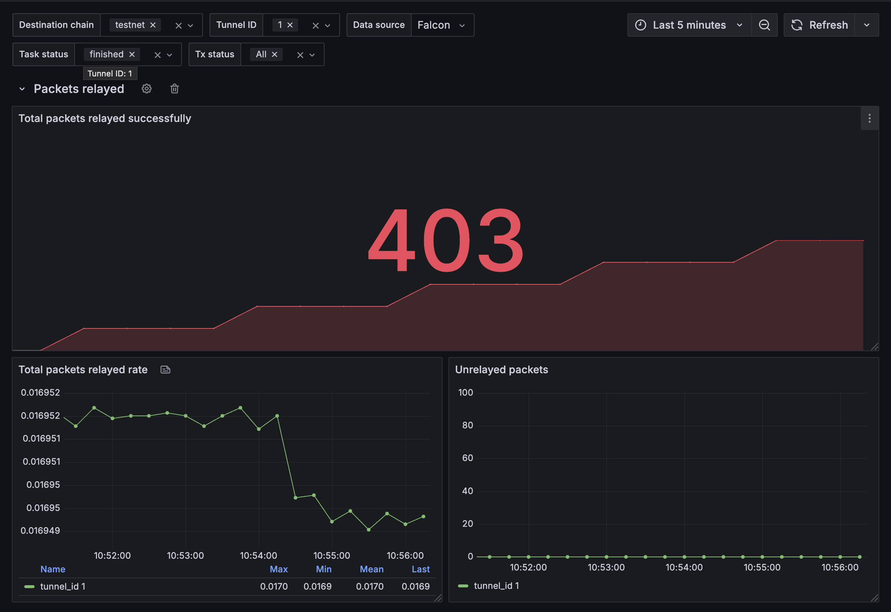
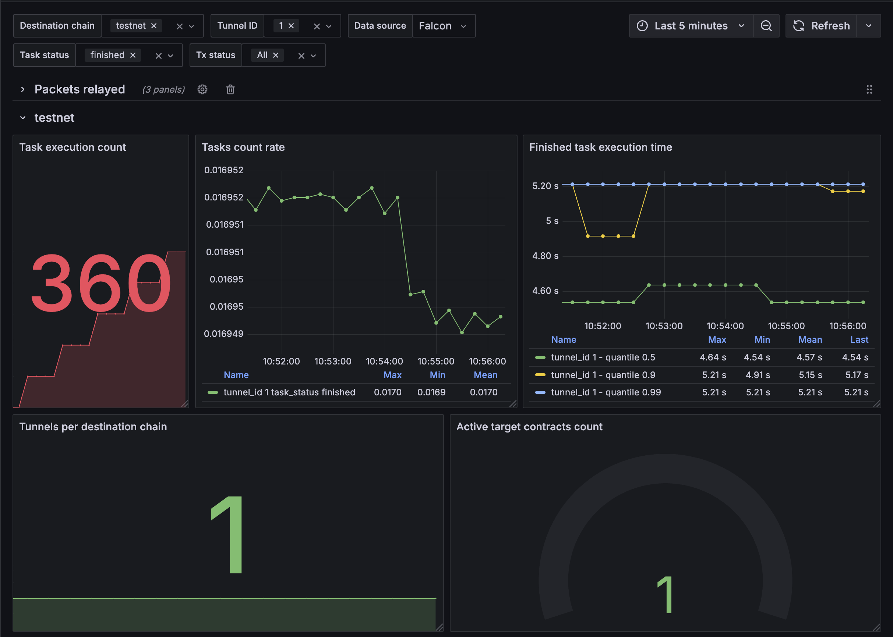

# Falcon Telemetry

## Metrics Tracked

The following telemetry metrics are captured and exposed via Prometheus:

### Packet Relaying Metrics

- `falcon_packets_relayed_success` (Counter): Total number of packets successfully relayed from BandChain

- `falcon_unrelayed_packets` (Gauge): Number of unrelayed packets (the difference between total packets from BandChain and received packets from the target chain)

### Task Execution Metrics

- `falcon_tasks_count` (Counter): Total number of executed tasks
- `falcon_finished_task_execution_time` (Summary): Execution time (ms) for finished tasks

### Tunnel and Contract Metrics 
- `falcon_tunnels_per_destination_chain` (Counter): Total number of tunnels per destination chain

- `falcon_active_target_contracts_count` (Gauge): Number of active target chain contracts

### Transaction Metrics
- `falcon_txs_count` (Counter): Total number of transactions

- `falcon_tx_process_time` (Summary): Processing time (ms) for transaction

- `falcon_gas_used` (Summary): Amount of gas used per transaction

## Grafana Dashboard
Grafana provides a pre-built Falcon Dashboard to visualize relay metrics efficiently. You can download and import the dashboard from Grafana's official repository.

- Dashboard Link: [Falcon Grafana Dashboard](https://grafana.com/grafana/dashboards/23038-falcon/)

### Example Screenshot:

